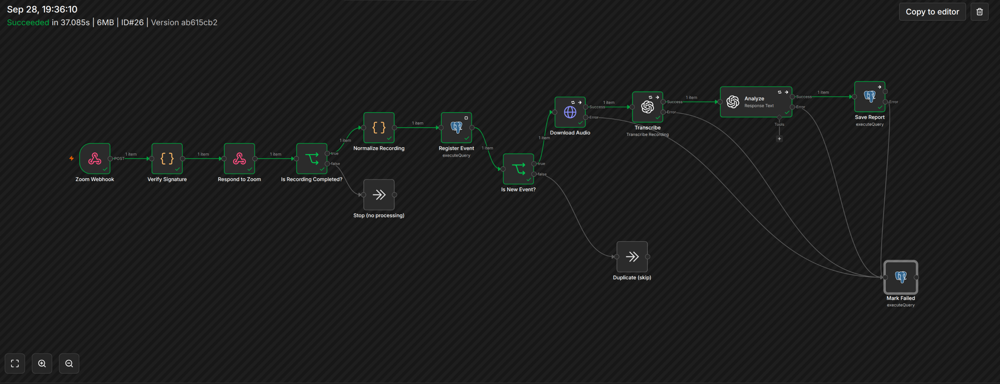

# Zoom Call Intelligence Pipeline

[English](README.md) · **Українська**

[](https://github.com/mmoskovchuk/zoom-call-intelligence/actions/workflows/ci.yml)
[](LICENSE)

Автоматичний пайплайн після дзвінка: **запис Zoom → n8n → OpenAI (Whisper + GPT) → звіт у Postgres**.

Користувач просто записує дзвінок Zoom у хмару, а структурований звіт (короткий підсумок, учасники, ключові тези, задачі) з'являється автоматично.



```
Zoom ──(recording.completed, підпис HMAC)──► Cloudflare Tunnel ──► n8n Webhook
                                                                      │
                     перевірка підпису / URL challenge ── відповідь 200 (<3 с)
                                                                      │
   нормалізація → реєстрація події (ідемпотентно) ─ дублікат? → пропуск
                     │ нова / раніше невдала                          │
                     ▼                                                ▼
   Download Audio → Transcribe (Whisper) → Analyze (GPT, strict JSON Schema) → Save Report
         └──────────────┴───────────── будь-яка помилка ────────┴──→ Mark Failed
```

### Приклад результату
Зберігається в `app.call_reports.analysis` (повний синтетичний приклад: [`docs/example-report.json`](docs/example-report.json)):
```json
{
  "summary": "Менеджер провів ознайомчий дзвінок з ACME Corp щодо автоматизації обробки клієнтських звернень. …",
  "participants": [{ "name": "Андрій", "role": "керівник служби підтримки, ACME Corp" }, …],
  "key_points": ["Звернення зараз розподіляють вручну три оператори", …],
  "action_items": [{ "task": "Надіслати комерційну пропозицію щодо пілотного проєкту", "owner": "Олена", "due": "до п'ятниці" }, …]
}
```
Мова звіту задається в системному промпті (українська); назви полів відповідають схемі.

## Стек
| Сервіс      | Призначення |
|-------------|-------------|
| `n8n`       | Оркестрація (зафіксована версія), дані в Postgres, бінарні файли на диску |
| `postgres`  | Метадані n8n + схема застосунку `app`: `processed_events` (ідемпотентність і статус), `call_reports` (транскрипт + аналіз у JSONB) |
| `mock-zoom` | Заміна сховища файлів Zoom для розробки й тестів: наскрізні тести без платного тарифу Zoom |
| `tunnel`    | Cloudflare quick tunnel → публічний HTTPS для Zoom (профіль `tunnel`) |

## Швидкий старт
```bash
make init          # .env зі згенерованими секретами
make up            # postgres + n8n + mock-zoom → http://localhost:${N8N_HOST_PORT}
make db-migrate    # схема застосунку (db/migrations/*.sql)
make import        # завантажити workflows/*.json
```
Потім створіть у n8n два credentials (вони ніколи не потрапляють в експорт для git) і оберіть їх у нодах:
- **Postgres**: host `postgres`, database `n8n`, user `n8n`, пароль з `.env`.
- **OpenAI**: API-ключ; обмежте *Allowed HTTP Request Domains* до `api.openai.com`.

```bash
make publish ID=zoomIntake00001
```

## Тести
Покладіть короткий запис мовлення в `fixtures/audio/sample.m4a` (див. `fixtures/audio/README.md`), потім:

| Команда | Що перевіряє | Витрати OpenAI |
|---|---|---|
| `make test-webhook` | перевірка підпису, URL validation, `401` при невірному підписі | — |
| `make test-idempotency` | та сама подія двічі → один рядок, дублікат пропущено | ✓ |
| `make test-failure` | аудіо відсутнє → повторні спроби → подія позначена `failed` | — |
| `make test-e2e` | повний пайплайн → рядок у `call_reports`, статус `done` | ≈ $0.006 за хвилину аудіо |
| `make last-execution` | підсумок останнього запуску (ноди, статус, метадані бінарних файлів, але ніколи не дані item-ів) | — |

GitHub Actions на кожен push запускає статичні перевірки ([`.github/workflows/ci.yml`](.github/workflows/ci.yml)): ruff для `scripts/`, валідність JSON, відповідність прикладу звіту схемі аналізу, «чистоту» експорту workflow (без даних власника і закріплених даних) і перевірку `docker-compose.yml`. Тести пайплайну вище потребують запущеного стеку й ключа OpenAI, тому виконуються локально.

## Рішення в дизайні
- **Спершу відповісти, потім обробляти.** Zoom чекає на відповідь протягом 3 с, а транскрибація триває хвилини.
- **Ідемпотентність.** `UNIQUE(idempotency_key)` + `INSERT … ON CONFLICT`: дублікати атомарно пропускаються, а раніше невдалі події обробляються повторно.
- **Structured Outputs.** GPT обмежено схемою [`schemas/call_analysis.schema.json`](schemas/call_analysis.schema.json) (`strict: true`), тож структура звіту гарантована.
- **Шлях помилок.** Помилки завантаження, транскрибації, аналізу чи збереження йдуть у вихід помилки → `Mark Failed` зберігає коротке повідомлення (але ніколи не сам невдалий запит, бо в ньому може бути транскрипт).
- **Атомарне збереження.** Вставка звіту й оновлення статусу виконуються одним SQL-запитом (CTE).

## Налаштування Zoom
1. Zoom Marketplace → *Develop → Build App → General App* (або Webhook-only app).
2. *Features → Access*: скопіюйте **Secret Token** → `ZOOM_WEBHOOK_SECRET_TOKEN` у `.env`, потім `make up`.
3. `make tunnel` → скопіюйте виведений URL → *Event Subscriptions* → Endpoint URL → **Validate**.
4. Підпишіться на **Recording → All Recordings have completed** (`recording.completed`).
5. Scopes: `cloud_recording:read:list_recording_files` (завантаження через `download_token`).

> URL quick tunnel змінюється після перезапуску, тож endpoint у Zoom треба валідувати заново.

## Workflows
| Файл | Опис |
|---|---|
| `workflows/zoomIntake00001.json` | 01 · Zoom Webhook Intake → повний пайплайн: перевірка HMAC (стійка до timing-атак, вікно повтору 5 хв), URL validation, нормалізація, ідемпотентність, завантаження, Whisper, аналіз GPT, збереження звіту, обробка помилок |

Workflow змінюються в інтерфейсі n8n і комітяться через `make export` (прибирає дані власника і закріплені дані).

## Безпека й приватність
- `x-zm-signature` перевіряється для кожного запиту; невірний підпис → `401`.
- n8n слухає лише `127.0.0.1`; публічним є тільки тунель.
- Секрети зберігаються в `.env` і зашифрованих credentials n8n; `.env.example` документує всі змінні.
- Тестові записи (`fixtures/audio/*`) ігноруються git; транскрипти лишаються в локальній базі.

## Ліцензія
[MIT](LICENSE)
